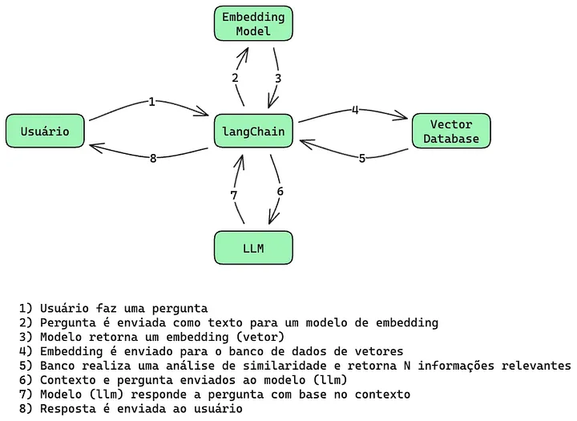

# Qdrant & RAG

## Python version: V3.11.8

**Instale as dependencias:**
```
pip install -r requirements.txt
```

**Inicialize o bando de dados usando docker:**
```
docker compose up
```

## RAG (Geração Aumentada por Recuperação)

RAG (Geração Aumentada por Recuperação) é uma técnica que trabalha com bancos de dados vetoriais e fornece contexto para os LLMs. O RAG é dividido em duas partes principais:

### - Preparação dos Dados:
  - **Obter conteúdo**: Obter o conteúdo que será armazenado no banco de dados vetorial (sites, arquivos, etc);
  - **Segmentação**: Preparar os dados em um formato que seja possível vetorizar;
  - **Gerar embedding**: Nesse contexto, embeddings são uma representação vetorial dos dados que armazenam o significado semântico do conteúdo;
  - **Armazenamento**: Armazenar os dados vetoriais em um banco de dados vetorial como o Qdrant.

### - Recuperação dos Dados:
  - **Consulta**: Qualquer possível pergunta ou demanda para a IA;
  - **Gerar embedding**: Converter o contexto da consulta para dados vetorizados;
  - **Pesquisar dados**: Buscar no banco de dados o contexto mais próximo relacionado aos dados vetorizados que correspondem aos dados do usuário e recuperá-los;

## Qdrant (Banco de Dados Vetorial)

**Qdrant** é um banco de dados vetorial de código aberto projetado para pesquisa de similaridade de alto desempenho. Ele armazena e indexa dados vetorizados, permitindo a recuperação eficiente dos vetores mais semelhantes com base em uma determinada consulta.

Qdrant é particularmente útil para aplicações como sistemas de recomendação, pesquisa semântica e mecanismos de pesquisa orientados por IA, onde o objetivo é encontrar informações relevantes com base na similaridade de conteúdo, em vez de correspondências exatas.

Ao utilizar técnicas avançadas de indexação e suportar vetores de alta dimensão, o Qdrant é otimizado para desempenho em tempo real em sistemas de grande escala. Ele se integra perfeitamente aos modelos de aprendizado de máquina, fornecendo fácil armazenamento e recuperação de embeddings gerados por modelos como GPT ou BERT da OpenAI.

## No nosso exemplo:


[Clique aqui para ver tutorial em vídeo](https://www.youtube.com/watch?v=KRiFMFVPL1Q)

[Clique aqui para ver tutorial em texto](https://datawaybr.medium.com/guia-definitivo-para-vector-databases-bbeeb8f0d802)